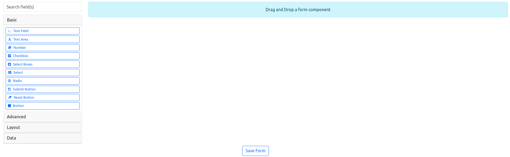
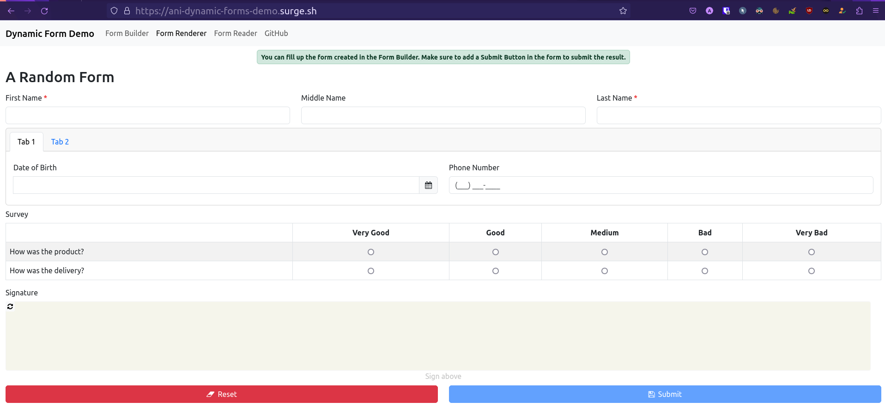
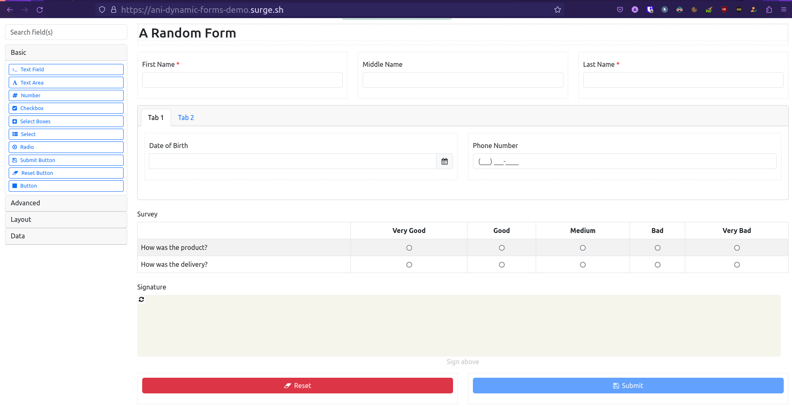
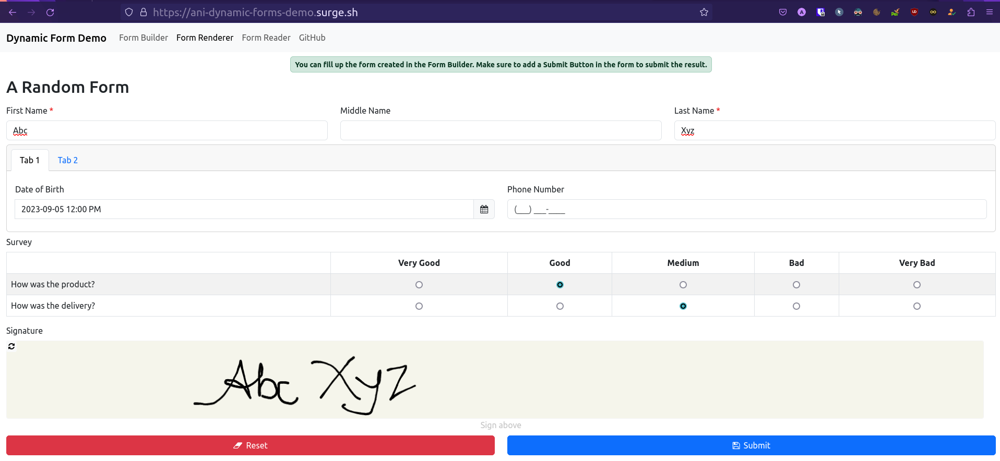
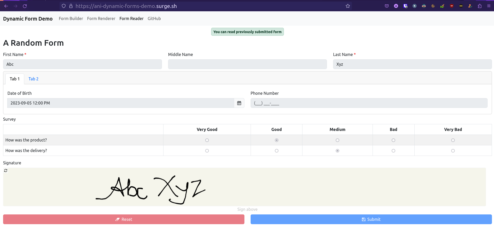

# Dynamic Forms

This is an Angular project consisting of two primary components: Form Builder and Form Renderer. These components enable users to create dynamic forms through a drag-and-drop interface, render the forms, submit them, and view the submissions. And all the forms and submission are stored in a JSON format. This project is built using the FORMIO library, focusing on the client-side aspects, and excludes server-side functionality.

### Demo : https://ani-dynamic-forms-demo.surge.sh/

## Form Builder

The Angular Dynamic Form Builder is a powerful tool that allows users to create forms in the UI using a drag-and-drop interface. This project provides a user-friendly way to design forms with various components and layout options and then export the form's configuration or structure in JSON format.

#### Inputs & Outputs

| Input/Output | Name   | Description                                                                                                           |
| ------------ | ------ | --------------------------------------------------------------------------------------------------------------------- |
| initialForm  | Input  | This is an optional input. If a JSON of a form is provided, that form will be loaded and then the user can edit that. |
| save         | Output | On clicking the Save Form button, this will emit the JSON of the form structure.                                      |

#### Screenshot



## Form Renderer

The Angular Dynamic Form Renderer can then render the form in json format created previously by the form
builder for the user to fill up. After submitting the form, a JSON will be created with the values of the submission by the Form Renderer. Then submission JSON can also be used to prefill the Form Renderer or show the submission in read only mode in the Form Renderer.

#### Inputs & Outputs

| Input/Output | Name   | Description                                                                                                                                                  |
| ------------ | ------ | ------------------------------------------------------------------------------------------------------------------------------------------------------------ |
| form         | Input  | This is the JSON of a form structure that will be rendered. The JSON will be created by the Form Builder previously.                                         |
| submission   | Input  | This is an optional input. If submission JSON is provided, that form will be prefilled by that and then the user can edit that if read-only mode is not set. |
| readOnly     | Input  | This is an optional input. If this readOnly mode is true, that form will not allow the user to edit it.                                                      |
| submit       | Output | On clicking the Submit button, this will emit the JSON of the form submission.                                                                               |

#### Screenshot



## Example

1. Creating Form using Form Builder
   
2. The form will be saved in JSON format

```js
{
  "components": [
    {
      "label": "HTML",
      "tag": "h2",
      "attrs": [
        {
          "attr": "",
          "value": ""
        }
      ],
      "content": "A Random Form",
      "refreshOnChange": false,
      "key": "html",
      "type": "htmlelement",
      "input": false,
      "tableView": false
    },
    {
      "label": "Name",
      "columns": [
        {
          "components": [
            {
              "label": "First Name",
              "applyMaskOn": "change",
              "validate": {
                "required": true
              },
              "key": "firstName",
              "type": "textfield",
              "input": true,
              "tableView": true
            }
          ],
          "width": 4,
          "offset": 0,
          "push": 0,
          "pull": 0,
          "size": "md",
          "currentWidth": 4
        },
        {
          "components": [
            {
              "label": "Middle Name",
              "applyMaskOn": "change",
              "key": "middleName",
              "type": "textfield",
              "input": true,
              "tableView": true
            }
          ],
          "width": 4,
          "offset": 0,
          "push": 0,
          "pull": 0,
          "size": "md",
          "currentWidth": 4
        },
        {
          "components": [
            {
              "label": "Last Name",
              "applyMaskOn": "change",
              "validate": {
                "required": true
              },
              "key": "firstName1",
              "type": "textfield",
              "input": true,
              "tableView": true
            }
          ],
          "size": "md",
          "width": 4,
          "offset": 0,
          "push": 0,
          "pull": 0,
          "currentWidth": 4
        }
      ],
      "key": "name",
      "type": "columns",
      "input": false,
      "tableView": false
    },
    {
      "label": "Tabs",
      "components": [
        {
          "label": "Tab 1",
          "key": "tab1",
          "components": [
            {
              "label": "Columns",
              "columns": [
                {
                  "components": [
                    {
                      "label": "Date of Birth",
                      "datePicker": {
                        "disableWeekends": false,
                        "disableWeekdays": false
                      },
                      "enableMinDateInput": false,
                      "enableMaxDateInput": false,
                      "key": "dateOfBirth",
                      "type": "datetime",
                      "input": true,
                      "tableView": false,
                      "widget": {
                        "type": "calendar",
                        "displayInTimezone": "viewer",
                        "locale": "en",
                        "useLocaleSettings": false,
                        "allowInput": true,
                        "mode": "single",
                        "enableTime": true,
                        "noCalendar": false,
                        "format": "yyyy-MM-dd hh:mm a",
                        "hourIncrement": 1,
                        "minuteIncrement": 1,
                        "time_24hr": false,
                        "minDate": null,
                        "disableWeekends": false,
                        "disableWeekdays": false,
                        "maxDate": null
                      }
                    }
                  ],
                  "width": 6,
                  "offset": 0,
                  "push": 0,
                  "pull": 0,
                  "size": "md",
                  "currentWidth": 6
                },
                {
                  "components": [
                    {
                      "label": "Phone Number",
                      "applyMaskOn": "change",
                      "key": "phoneNumber",
                      "type": "phoneNumber",
                      "input": true,
                      "tableView": true
                    }
                  ],
                  "width": 6,
                  "offset": 0,
                  "push": 0,
                  "pull": 0,
                  "size": "md",
                  "currentWidth": 6
                }
              ],
              "key": "columns",
              "type": "columns",
              "input": false,
              "tableView": false
            }
          ]
        },
        {
          "label": "Tab 2",
          "key": "tab2",
          "components": []
        }
      ],
      "key": "tabs",
      "type": "tabs",
      "input": false,
      "tableView": false
    },
    {
      "label": "Survey",
      "tableView": false,
      "questions": [
        {
          "label": "How was the product?",
          "value": "howWasTheProduct",
          "tooltip": ""
        },
        {
          "label": "How was the delivery?",
          "value": "howWasTheDelivery",
          "tooltip": ""
        }
      ],
      "values": [
        {
          "label": "Very Good",
          "value": "veryGood",
          "tooltip": ""
        },
        {
          "label": "Good",
          "value": "good",
          "tooltip": ""
        },
        {
          "label": "Medium",
          "value": "medium",
          "tooltip": ""
        },
        {
          "label": "Bad",
          "value": "bad",
          "tooltip": ""
        },
        {
          "label": "Very Bad",
          "value": "veryBad",
          "tooltip": ""
        }
      ],
      "key": "survey",
      "type": "survey",
      "input": true
    },
    {
      "label": "Signature",
      "key": "signature",
      "type": "signature",
      "input": true,
      "tableView": false
    },
    {
      "label": "Columns",
      "columns": [
        {
          "components": [
            {
              "label": "Reset",
              "action": "reset",
              "showValidations": false,
              "theme": "danger",
              "block": true,
              "leftIcon": "fa fa-eraser",
              "key": "reset",
              "type": "button",
              "input": true,
              "tableView": false
            }
          ],
          "width": 6,
          "offset": 0,
          "push": 0,
          "pull": 0,
          "size": "md",
          "currentWidth": 6
        },
        {
          "components": [
            {
              "label": "Submit",
              "showValidations": false,
              "block": true,
              "leftIcon": "fa fa-floppy-o",
              "disableOnInvalid": true,
              "key": "submit",
              "type": "button",
              "input": true,
              "tableView": false,
              "saveOnEnter": false
            }
          ],
          "width": 6,
          "offset": 0,
          "push": 0,
          "pull": 0,
          "size": "md",
          "currentWidth": 6
        }
      ],
      "autoAdjust": true,
      "key": "columns1",
      "type": "columns",
      "input": false,
      "tableView": false
    }
  ]
}
```

3. Viewing the form and filling it up
   
4. After submit, it will give a submission JSON

```js
{
  "data": {
    "firstName": "Abc",
    "middleName": "",
    "firstName1": "Xyz",
    "dateOfBirth": "2023-09-05T12:00:00+05:30",
    "phoneNumber": "",
    "survey": {
      "howWasTheProduct": "good",
      "howWasTheDelivery": "medium"
    },
    "signature": "data:image/png;base64,iVBORw0KGgoAAAANSUhEUgAAB2gAAACWCAYAAAAbv9hLAAAgAElEQVR4Xu3deXhV5bn38ZvBESQenMoUFKcyBA9QLSEGC3UgFFqcSmw4guKbqAGsVMIQ8LRAAgScQKrJqS0oOQahgA2GOBQqSIJY0DcRROtwCAXrLGhEXwHfdW9OtnutrCR7XHvtvb/rurjQsNYzfJ6V/c9v38/Tqr7+o++ECwEEEEAAAQQQQAABBBBAAAEEEEAAAQQQQAABBBBAAAEEEEAg4gKtCGgjbkwHCCCAAAIIIIAAAggggAACCCCAAAIIIIAAAggggAACCCCAgEeAgJYXAQEEEEAAAQQQQAABBBBAAAEEEEAAAQQQQAABBBBAAAEEEHBIgIDWIWi6QQABBBBAAAEEEEAAAQQQQAABBBBAAAEEEEAAAQQQQAABBAhoeQcQQAABBBBAAAEEEEAAAQQQQAABBBBAAAEEEEAAAQQQQAABhwQIaB2CphsEEEAAAQQQQAABBBBAAAEEEEAAAQQQQAABBBBAAAEEEECAgJZ3AAEEEEAAAQQQQAABBBBAAAEEEEAAAQQQQAABBBBAAAEEEHBIgIDWIWi6QQABBBBAAAEEEEAAAQQQQAABBBBAAAEEEEAAAQQQQAABBAhoeQcQQAABBBBAAAEEEEAAAQQQQAABBBBAAAEEEEAAAQQQQAABhwQIaB2CphsEEEAAAQQQQAABBBBAAAEEEEAAAQQQQAABBBBAAAEEEECAgJZ3AAEEEEAAAQQQQAABBBBAAAEEEEAAAQQQQAABBBBAAAEEEHBIgIDWIWi6QQABBBBAAAEEEEAAAQQQQAABBBBAAAEEEEAAAQQQQAABBAhoeQcQQAABBBBAAAEEEEAAAQQQQAABBBBAAAEEEEAAAQQQQAABhwQIaB2CphsEEEAAAQQQQAABBBBAAAEEEEAAAQQQQAABBBBAAAEEEECAgJZ3AAEEEEAAAQQQQAABBBBAAAEEEEAAAQQQQAABBBBAAAEEEHBIgIDWIWi6QQABBBBAAAEEEEAAAQQQQAABBBBAAAEEEEAAAQQQQAABBAhoeQcQQAABBBBAAAEEEEAAAQQQQAABBBBAAAEEEEAAAQQQQAABhwQIaB2CphsEEEAAAQQQQAABBBBAAAEEEEAAAQQQQAABBBBAAAEEEECAgJZ3AAEEEEAAAQQQQAABBBBAAAEEEEAAAQQQQAABBBBAAAEEEHBIgIDWIWi6QQABBBBAAAEEEEAAAQQQQAABBBBAAAEEEEAAAQQQQAABBAhoeQcQQAABBBBAAAEEEEAAAQQQQAABBBBAAAEEEEAAAQQQQAABhwQIaB2CphsEEEAAAQQQQAABBBBAAAEEEEAAAQQQQAABBBBAAAEEEECAgJZ3AAEEEEAAAQQQQAABBBBAAAEEEEAAAQQQQAABBBBAAAEEEHBIgIDWIWi6QQABBBBAAAEEEEAAAQQQQAABBBBAAAEEEEAAAQQQQAABBAhoeQcQQAABBBBAAAEEEEAAAQQQQAABBBBAAAEEEEAAAQQQQAABhwQIaB2CphsEEEAAAQQQQAABBBBAAAEEEEAAAQQQQAABBBBAAAEEEECAgJZ3AAEEEEAAAQQQQAABBBBAAAEEEEAAAQQQQAABBBBAAAEEEHBIgIDWIWi6QQABBBBAAAEEEEAAAQQQQAABBBBAAAEEEEAAAQQQQAABBAhoeQcQQAABBBBAAAEEEEAAAQQQQAABBBBAAAEEEEAAAQQQQAABhwQIaB2CphsEEEAAAQQQQACB4wI1NbVSW7tLUlJ6S9++KbAggAACCCCAAAIIIIAAAggggAACCCCQUAIEtAm13EwWAQQQQAABBBCIrkBBQZEUFi70DqK4eLGMGXNTdAdF7wgggAACCCCAAAIIIIAAAggggAACCDgoQEDrIDZdIYAAAggggAACiSyQnT1RSkvLTAR9+/aR6upNiczC3BFAAAEEEEAAAQQQQAABBBBAAAEEEkyAgDbBFpzpIoAAAggggAACTgt8/vlBuemmsbJ589ZGXaek9JFt2whonV4T+kMAAQQQQAABBBBAAAEEEEAAAQQQiJ4AAW307OkZAQQQQAABBBCIe4Fly56QmTPnyGeffWY7V7Y4jvtXgAkigAACCCCAAAIIIIAAAggggAACCFgECGh5JRBAAAEEEEAAAQTCLqBVs9On3yuPP/7ftm0nJXWQ4uIlMnLk8LD3TYMIIIAAAggggAACCCCAAAIIIIAAAgi4WYCA1s2rw9gQQAABBBBAAIEYFNBwNiNjlNTUvG47+uTkbrJy5XLp2zclBmfHkBFAAAEEEEAAAQQQQAABBBBAAAEEEAhNgIA2ND+eRgABBBCIE4G9e+vk978v8czmzjuzpXv35DiZGdNAwFmBmppaycmZ1GQ4O2JEhqdy9vTTk5wdGL0hgAACCCCAAAIIIIAAAggggAACCCDgEgECWpcsBMNAAAEEEIiegFb7/fCH/eSLL77wDOKMMzoa4dJ2AqToLQk9x6iAhrMZGdeK/k5Zr1atWsmkSXdIYeHvYnR2DBsBBBBAAAEEEEAAAQQQQAABBBBAAIHwCBDQhseRVhBAAAEEYlhg2bInJDd3smkGZWXLORszhtfUqaFrILl+faW8+mqN1Na+Lqed1l7q678SrchuuHr37imnnHKKnHtud7n44gu9P09PT5OUlN5x80WA2tpdcvnlP5UjR4424qdq1qk3kn4QQAABBBBAAAEEEEAAAQQQQAABBGJBgIA2FlaJMSKAAAIIRFRg4cIH5be/LTD1cc01V8qaNU9GtF8aj10BrRC9/fZJUl5eEfIk+vbtI4MHp8mIEcMlPX1QyO1Fq4Hs7AlSWrqyUfdZWZlSUrIkWsOiXwQQQAABBBBAAAEEEEAAAQQQQAABBFwnQEDruiVhQAgggAACTguMHn2zUQW5wdStno+5f//bTg+F/mJAYPPmrXLTTWNtt/ENdfht27Yxtgi+xqjezjCqUQfFzFnIWkl8zTW/kEOHjm8T3nDl5mZLUZH5yw+hGvE8AggggAACCCCAAAIIIIAAAggggAACsS5AQBvrK8j4EUAAAQRCFujZs7/U1e1r1E59/Ucht00D8SWgWxf36jXAsUk1VNfeeWe2q8PagQOHeLZ49r0yMq6W1atLHbOiIwQQQAABBBBAAAEEEEAAAQQQQAABBGJFgIA2VlaKcSKAAAIIREygXbuzbNtetqxEbrzx2oj162/DWrG5aNGDcvjw1zJr1jTPdrhc0RF4+OFimTp1ZpOdn3DCCfKjH/UXrYTVcDUpKclTaVtZ+bycfPJJcsYZHb3Pfv75oUahZnOz0nUfMyZTdMtgN10FBUVSWLjQNKTk5G5SXb0pbs7XdZM3Y0EAAQQQQAABBBBAAAEEEEAAAQQQiH0BAtrYX0NmgAACCCAQgoBuzZqaOtS2heLixUYgdlMIrYf+qFZs/uhHl8tXXx32NNa6dSupqtokKSm9Q2+cFgIWsHtfUlL6GGesLjYC2ZSA22t4QEP4d955Tw4cOGCca7uh2eC2e/dkyc+f4oqgVsPnc8/tKd9++6137klJHYxAel1IHkFD8iACCCCAAAIIIIAAAggggAACCCCAAAIxIEBAGwOLxBARQAABBCIn0FxF5IwZU4wgLC9ynfvR8ooVT0pOziTTnVqh+eKLz/rxNLdEQkDfmcLCIk/Tubk5EXlHNPhcv77CE9Zu2bJVDh481GgqZ555hmRm3iDR3P74kksGyttvv2Mamxu+2BCJdadNBBBAAAEEEEAAAQQQQAABBBBAAAEEwiVAQBsuSdpBAAEEEIhJAbuzMxsmkp4+yKgEfDqq82rqfNwNG9ax1XFUV8bZzjWo17B2/foNth3rdsr6ZYIRIzIcG5jd1sYnnXSSfPrpPx0bAx0hgAACCCCAAAIIIIAAAggggAACCCAQiwIEtLG4aowZAQQQQCAsArp9cK9eA5psS7eS3b17R1j6CqaR5saXm5stRUUFwTTLMzEsoO/EpElTZNOmF+Xo0aONZqLn1D766GLRdzeSl11ld4cOp8nq1aWSlpYaya5pO8wCWq390ktVnlZ37XrD2LK6u4wefX2Ye6E5BBBAAAEEEEAAAQQQQAABBBBAAAFfAQJa3gcEEEAAgYQVyMvLl6VLS5qd//79b8vppydFxUjPJc3IGGXbd7TD46iA0KlJoLy8QlasKLOtqtVqWt36OBLvbnb2RCktLTONRc/h1XNnI9Efyx4ZAQ1m581bKLplt/W67bZx8tBDCyPTMa0igAACCCCAAAIIIIAAAggggAACCAgBLS8BAggggEDCCvzgB+fJF1986Z1/cnI3qavbZ/KI5lbCq1atlXHjsptcn2iGxwn70rhw4lpVW1CwsFFo2rZtG+P82uelb9+UsI3arqqbcDZsvBFvSNdPq2VLSv4kr776mlGFfazJPuvrP4r4eOgAAQQQQAABBBBAAAEEEEAAAQQQSFQBAtpEXXnmjQACCCS4wJ/+tEImTLjbpDB58kS5//4lpp8tWDDXuC8nKlpz5syX+fPva7Lv7Ozx8sAD86MyNjp1n4BWXOfkTDR9yUArWnXL45Ejh4dlwMOG/cIIfY9vh6tXjx7neUJgKmfDwhv2RrRK9plnNnjOL66peV00oPXn6ty5k/zjHzX+3Mo9CCCAAAIIIIAAAggggAACCCCAAAJBCBDQBoHGIwgggAACsS9g3aa1devWRjXtB9Ku3VmmyUXzrFe7rWR9B3fppf3lb397NvYXgxmETUADuUmT7pE//3mdqc3i4sUyZsxNIfVTUFAkhYXfb3vbtWsXefnlFwlnQ1INz8M1NbVSW7vLCGD3GYH5VtH3QANZf6709EEyZMhgmT37+y976M8qK5/253HuQQABBBBAAAEEEEAAAQQQQAABBBAIQoCANgg0HkEAAQQQiH2Bzp3Pl4MHD3knctdduUb49FsZPfpm05me0QwqrNWKdupsQxr772IkZqDn02o1re87rgGtBrXBXNbzkJOSOnjOnA3n9snBjCvRntEK2Lq6f3rC17q6Os/f+kcD2UAuXb9Bg1IlM/N6ueGGa8W6vloRrVuocyGAAAIIIIAAAggggAACCCCAAAIIREaAgDYyrrSKAAIIIOBiAbuw6cCBdzwjfvjhYpk6daZ39Cec0NYIP96Pymys1bwnnXSSfPPNN6axENBGZWliolOtqhw2bJQppB08OE2efHJ5QFWvGv4NGjTUtD1uOCpyYwIxCoPUzyc9J1YrYfXS/w/10kA2PT3N82fw4EGNgnXr556eK7xt26ZQu+V5BBBAAAEEEEAAAQQQQAABBBBAAIEmBAhoeTUQQAABBBJOICvrFlm3br133r7bGGuFWq9eA0wmWkkWjTM2rQFtr14/lN2795jGtmHDOiNwSUu4NWTC/gno+zx69Fhj+9vvt7vV90XfG38va1V5NM9l9nfMsXafhumlpStlxYqygKthfeeanNxNunfvZgSwfSQpKUlat24ll1xyiQwffnWzJD179jedXZyVlSklJebzuGPNlPEigAACCCCAAAIIIIAAAggggAACbhYgoHXz6jA2BBBAAIGICFiDz927dxihRrK3r65dL5TPPvvc+/9lZctl5MjhERlLU41u3VotV1/9c9M/p6UNlK1bt5l+RkDr6LLEZGdaAauVtL4hrb/bHS9b9oTk5k72zjuaW37HJH4Lg9bqWK3Y9/e8WN/mtMq1IYzVylgNZYP5IomePbtgwX2mkUbjMy8e15c5IYAAAggggAACCCCAAAIIIIAAAk0JENDybiCAAAIIJJSAhlVdulzgnfMZZ3Q0KsfeNBnk5eXL0qUl3p9Fo5ps1ao1Mm5cjmlcl132I9m+/e+mn1nD5YRaTCbrt4BdSDt58kSZM+feJtvQqs7Bg6+Wb7894rnntNPay549rwUVAvo90Bi8UW21+lWvrKzRfvvYVes3NX2tjB048FKjEvYa0c8B3y+UhEKmY+/e/WI5cuSot5kOHU6T999/N5RmeRYBBBBAAAEEEEAAAQQQQAABBBBAoAUBAlpeEQQQQACBhBIoL6+QzMyx3jnfdttYeeihRSYD6z1alabbHDt5FRQUSWHhQlOXl17aX155ZafpZ5xB6+SqxHZfGsb16tXfdCbtzJl5Mn36lEYTszt3dv782TJx4h2xjRDm0WuIPXZstrz11vHPB92G/JVXtvjVi/XcV7uH9MshI0dmRKyC324M2dnj5YEH5vs1B25CAAEEEEAAAQQQQAABBBBAAAEEEAhOgIA2ODeeQgABBBCIUQFrdazdVp7WKludanX1RmML0RTHZp2dPdGoyivz9peU1MGzhemWLVXen+kWp9u2bXJsTHQU+wK6pW5GxijvRLQq9rnn/tLo3R427Bemdy0j4xpZvXpF7AOEcQZWy4am/f3ShIa7qalDG41If68nTMiWESOG+12NG+y0rGfPajvbtv1NUlJ6B9skzyGAAAIIIIAAAggggAACCCCAAAII+CFAQOsHErcggAACCMSPQOfO53srCDX0PHDgHdvJWQOqBQvmGqGJecvhSKpY+09N/bEREr9s6nLEiAxZufLxSA6DtuNQYPTom2X9+g3emWmF+IYNa70hrfXLAXwRwP4lsP6ONtwVyLnQWsFaWFjkeVQD2TFjMo1tpdMceevsAuZobOfuyGTpBAEEEEAAAQQQQAABBBBAAAEEEHCZAAGtyxaE4SCAAAIIRE7AunVxbm62FBUV2HZo3WLY6eDCWtlmF9DeddedRrjzu8iB0XLcClhDWD3TtKpqoxHcVkhOziTvvPVLDLt374x4JWesQTd3fqxdVb4b52cXMAcSLrtxTowJAQQQQAABBBBAAAEEEEAAAQQQiBUBAtpYWSnGiQACCCAQssCtt95uVJz+2dtOc9sWW6vLNMDavXtHyGPwt4F27c4y3aph8tKlJaaf3XlntixcaB8w+9sP9yWmgG7jPWzYKKmtfd0L0KnTD+T99/9lAnF6a+9YWY1bbsmRp55aYzvcGTOmSH5+nqunUlHxnNx4Y5ZpjFRKu3rJGBwCCCCAAAIIIIAAAggggAACCMSZAAFtnC0o00EAAQQQsBfQQKp794vlyJGjnhvOPvtsee+9Xc1yWUNSDWg1qHXisvZdXLxYCgoWSV1dnbf7WAiCnLCij+AE7EJa35b0nRsz5qbgGo/jp6yfJdapxsLvZadOPeTQoS9MQ6d6No5fWqaGAAIIIIAAAggggAACCCCAAAKuEyCgdd2SMCAEEEAAgUgIWLcsHjr0CikvX91sV9YtQJ3cutQa0Gp4kpc301Tx6PS5uJFYF9qMroBu1ZuaOsR7LnPDaLKzx8sDD8yP7uBc2rvd2a2+Q3X776X1s1DHfs01V8qaNU+6VJxhIYAAAggggAACCCCAAAIIIIAAAvEnQEAbf2vKjBBAAAEELAJa8da79wDRv/U688wz5P/+35dbPFfz4YeLZerUmd7WmjuzNtzo1oB2//63pUuXC0zdsP1suNUTs72srFtl3bpy0+Spnm36XWgpoHVzJard2bknnHCC/M//vNHi52Fi/nYwawQQQAABBBBAAAEEEEAAAQQQQCAyAgS0kXGlVQQQQAABFwlYK8b8rYS1hhl9+/aR6upNjszMGtDW138kdj9zZDB0ErcCK1Y8KTk5k2zn5+agMZoL0pyZjsvNX5yw7gqg42Wdo/k20TcCCCCAAAIIIIAAAggggAACCCSqAAFtoq4880YAAQQSSKBz5/O9W7impw+Sysqn/Z59z579jXNf93nv10rW009P8vv5YG+02+I4I2OUqTkNbbkQCFagpqZWMjKu9VaWn3LKKXL48GFvc/qe79q1w5H3Pdg5ROM5uy2Cfcfh1t9Lu8pfJ3cFiMZa0ScCCCCAAAIIIIAAAggggAACCCDgVgECWreuDONCAAEEEAiLgLXaLdBqsby8fFm6tMQ7Fn+rb0MdvDWgTU7uZgqKdZvmvXv3hNoNzyeogHXbb2XQys+HHy6R0tIyr8rgwWmeCkuu7wViNaC1Vs8mJXWQ3bt3EsDzciOAAAIIIIAAAggggAACCCCAAAJRECCgjQI6XSKAAAIIOCNgDaECrZ7VUWqVYWrqUO+AR4zIkJUrH4/oBHTc1vNmfTs88cQT5Zln/iyDBg2M6DhoPH4FBg4cIrW1r3sn6HvmrDXIW7BgrkyYkBO/GAHOLBYDWrvqWae+bBIgL7cjgAACCCCAAAIIIIAAAggggAACCSFAQJsQy8wkEUAAgcQUsFa/Blo926DWocMP5OjRo57/7dHjPCPY2h5RUOvZt9bOCMwiyh/3jWdnTzRVyVq3udUvCPTq1d+7LbiCLFtWLDfeeF3c2/gzQbtzXBueS0npI9u2OXNOtT9jbbjHOmYnvmgSyPi4FwEEEEAAAQQQQAABBBBAAAEEEEg0AQLaRFtx5osAAggkiIC1YiwrK1NKSpYENfsbbxwjFRXPep+N9BmTdtVuDZ0HUwUc1KR5KC4FrFt+NxXUWd/Biy66QF59tTqiJtrnvHkLPX1Mnz5FdHtlN17NBbRu/P289945ct99i72UbG3sxreKMSGAAAIIIIAAAggggAACCCCAQKIJENAm2oozXwQQQCBBBPr3T5M333zLM9vTTmsve/a8FvRZiw8/XCxTp870yulZnX37pkRMsqkKWq3Oq6xcF/Q8IjZgGo4JgdWr10pOzkT5+utvPONt6X26557p8sgjf/DOzXcb5HBP2O6d122VtVrcbZf1fGjf8bkxoD333J7y0Ucfe4cZ7E4CblsHxoMAAggggAACCCCAAAIIIIAAAgjEsgABbSyvHmNHAAEEELAVsJ7hOmvWdJk2bXLQWtZqwkgGVTpIa5Wj/qylMC3oyfFgQgjoWcpDhmR4w9kOHU6TZ599usUvGvTs2V/q6vZ5jLp3T5bdu3dExMv6JYiGTvr27SN6Vqr27ZaruYB2xowpkp+f55ahitX1l7+8Tv70p2LXjI+BIIAAAggggAACCCCAAAIIIIAAAokqQECbqCvPvBFAAIE4FigoKJLCwuNbpWr17L/+9V7Is/UNZULZLrmlgdiFs61atZIvv/yw2Ue1AvGll6rk5Zf/Llu3bpMTTzzBW2mbnp5mBFzd5Gc/y6D6tqUFiMN/13A2I+Na0S8uNFyPPfaIZGbe0OJsre9jpAJIHWNq6lDb8Zx+epI8+uhiGTlyeIvjjfQN1i9/WPuL9Jc3ApmfjrV37wHedU9O7iZvvLEzkCa4FwEEEEAAAQQQQAABBBBAAAEEEEAgQgIEtBGCpVkEEEAAgfAKaABZV/dPo5K0d4sho2/VX7gCJd9zJyNVSWjdUrZBsHXr1vLFFx80CZqXly9Ll5b4Bd6tW1fRKrqrrvqp6HasXPEtoCFdRsYoqal53TvRgoL/lF//eoLfEx84cIjU1h5/XsPSqqqNEalobaqKtmGgbgg/mzsfWse5alWpDB9+td+2kbzR94sq2o8b/CI5X9pGAAEEEEAAAQQQQAABBBBAAAEEYkmAgDaWVouxIoAAAgkkoBV1kydPl3fffU80oHz//X95Z3/WWWdK+/btpVOnc6Rt27aenycnJ0tSUgfZtOlFYxvWPd57dUvWcGyPag2P9u9/u8WgOJDlsquc9X2+vv6jRs1paJ2ZOdYUvgXSp7osWDDHFZWJgYybe/0X8P1igT4VTPW3NZQcPDhN9BzTSFz6ez969FjvtsrWPsaMuckTNEbraimgdcv5rlTPRusNoV8EEEAAAQQQQAABBBBAAAEEEEDAPwECWv+cuAsBBBBAwEEBDRcuvDBFvvrqcMi96hmWGupkZY0OKVC1bsEaziCmpXBWEawB7d69+4zzQy+VI0eOhmx0zjlnyxNP/EHS0lJDbosG3CNgrazWiunKyqeDGqC1LT0XNlJbDuvvf17eTCktLbMd6xVXpEtFxZqg5hHqQ7ES0FqrZ8P5eRWqIc8jgAACCCCAAAIIIIAAAggggAACCIgQ0PIWIIAAAgi4TmD06Jtl/foNYR2XVtdedtmlRvDzaxk0aGBQbZ9zzrnGWbD1nmfHjx8rixcvCqod34fstnXVauC6ujpT29aA9sorfybV1dtD7t+3gfz8PNEtobliX8Aa+uv5o9XVm4L+koKGpr169ZeDBw95cCK1zbevvM5Bg9qGPn3/rUeP82TLlueDnk+wK6xV6716DWjy8XBV7Ac7Pn3OWj0bSjAfyjh4FgEEEEAAAQQQQAABBBBAAAEEEECgaQECWt4OBBBAAAFXCZSXV3i27Y3U1bp1K5k/f67k5mYH3EWfPj+S997b63luwIB+snnzcwG34ftAdvbERlWCDUFaly4XmNr2DWibOnNW5zRjRl6j0EpDpfnz75N168rl0KEvmh2zbl/75JPLHQ++QoLkYZPAH/+4XCZOvMf7M/1yQmXlOqPiOiUkKeuXCZw401Tf3ZyciUYYW9Vo7Fodr5Whei6uk1e7dmfZdqfOBw684+RQbPuyhvNUz0Z9SRgAAggggAACCCCAAAIIIIAAAggg0EiAgJaXAgEEEEDAVQLWMzN1cBpa5ubmGAFTH895q489tkw++OBDT+Ck1WH6M93yt7b2db/nEsz5qyUlf5S7757q7cPuXFh/BqAVbj/96XDZs+ct0+06z5Url3vmZQ2BGvpqaovV7Ozx8sAD81vsXvtev75C7r//YXnzTXP/DQ/7G3xpeFZYuMhT7avtfv31N0a140Hp0qWTd+tlDc8+/vgTOXz4a+nR41zj3OBORvVlN2Pd0iQlpbfj4VqLQDF+g67Duef+UL799oh3JuEMUnv27O89H7Zbt67GO/yqI2IaDk+ffq8cO3bM1J++Xxs2rA05fA5kEk0FtCNGZBi/v48H0lRE7h04cIj3s5Dq2YgQ0ygCCCCAAAIIIIAAAggggAACCCAQsgABbciENIAAAgggEE4Bu4DWnyDU9zndplcDQA0iV6wos90itWHMeo7mo48u9isotCBayPoAACAASURBVG5vGsw5nHqWbWbmOCNQNm9hnJLSx1Pl2FAN2FRAa7f9c7AhzD33TJc//vEJ+eabbxotoVbjFhUV2C7t1q3VxhbPd8q+ff8Meek1DNb1itR5piEPMMYasL4fkydPkjlzZoVtFtbqzDvuuE0WLZoXtvaba0i/hDFixPXy7rvvmW7T35kFC+Z4zpp24urW7WL59NNPG3W1YMFcmTAhx4khNNnHs88+L9dd9yvvv1M9G9XloHMEEEAAAQQQQAABBBBAAAEEEECgSQECWl4OBBBAAAFXCdx++yR54oknTWMaPPhyY9vdZU2GqL5VpbrN6O7dO033PvjgUpk9e55tEKkdnX/+eZ4wctiwq1q08K1Oy8rKlJKSJS0+03BDQUGRUXG6sNH9Ws1bVbXRNGa7gFYDKj0H1PcKx9mimZk3224hO3/+bGOr3DtM/Wmw3K9fqmH5//yetz83uuHsTn/G6eZ7rFsQ65cUNPQP56UVusnJF8vRo0c9zZ566inyj3/U+vUFh3CMQ/sfNmyUbbV8QcF/yq9/PSEc3TTbRqdOPWy3Cq+u3uhoJa/dIG+8cYxUVDzr+Sf9bHjjjZ0R96ADBBBAAAEEEEAAAQQQQAABBBBAAIHABQhoAzfjCQQQQACBCApoVecjj/yhUQ/t27eTNm3aGNvndjZCmFz52c8yvKGQb9VgU6GpBjtLlxbbBqQNnWkF3owZ9xhb8CY3OUPf81+1cm/Xrh0thlNaNZuTM8mzFbP10rNs//KXVY3asAtoBw78iRFM7TI1Ea7ta+3Ow23TprWxne1bprE1FTKH+kpoFW1+fl6ozSTs8/qOpaYO9c4/1OC+OchJk+4xthlf7r1Fq5+1mtzJq6lzmG+7baw89NCiiA7Fbovjiy66QF59tTqi/bbUuH7G+Z5dvWTJIrn11sid593SePh3BBBAAAEEEEAAAQQQQAABBBBAAIGmBQhoeTsQQAABBFwlYA2amhucBkOpqZcZoepvvbe1VImpFaB5eTON7Y832Dbd0nap1vE1t8WrBiZTp84ytlk2VwQ3dNzclqjWEEiDWA15fa/WrVvL66+/0myg7O/i6lgvv/wqee898/axvgGw3tO79wDPebO+12mntZd///e+RrXem8ZZs4c9lXtnnnmG55YjR47KO++8Jx9++GGzQ3FD9aG/Vm67T9cjI2OU6QsAkfb0rSRXj2hspauV8zk5E71n4jasi26bre+tnuUc7mv16rUydmx2o2bD9UWJUMbr++UJqmdDkeRZBBBAAAEEEEAAAQQQQAABBBBAIPICBLSRN6YHBBBAAIEABTTQnDIl33Yb0eaauvTSAfK3v1X61Zv1LE3rQxrylJQ8LCkpvRu117FjV+92yd26dZE9e15rdM+sWXOM812XNwoz9Ubdhrm4eEmz565aA1oNXOrq9pn6ufnmXxnVxg/5NV9/brKeX6nPaDWxht56lZdXGOfnmivyOnfuJK+8sqXFKmJ9XoNErSLesmXr//6p8rRL9aw/q9P0PdbqZyfCQusXFey26Q5tVv493dyWx7/85fUyefJE299h/1o336XV66mpP5HvvjP/XM+P3rZtUzBNhu0ZdejZs5/3M5PfqbDR0hACCCCAAAIIIIAAAggggAACCCAQEQEC2oiw0igCCCCAQKgCzQUvzbWtFbAjRgw3ws8M4++MZodRUfGcjBuXLfX19bb3tWol8uyzf5G0tFTTv9966+2ycuWfvT/zrdrV4HfSpClNnnebnj7IE842t42yNmy3jarvILSdysqnQ2Vu9PyAAWlG4PyW6ecN1ZF22xvr1rZaycwVHQHrFw0CPRc5lFFbtxnOzc32nOUcjUvP3y0sLJKDBw816l63ztbAMpRLP4/S06+Sd981V5hr9fhzz/0lItW6gYx33LgcWbVqje1nUiDtcC8CCCCAAAIIIIAAAggggAACCCCAgDMCBLTOONMLAggggECQAhpAlZdvkNdeq5H9+w8Y1WuW8rVm2j3xxBOkR48eRhXdBGP73kFNhqLah257bBfuaPPWikTdJrlXrwHenqdO/Y20bdvG2Mq4TPTf7C6tmi0qmit6zq0/V0sBbaS2lLWrLNage+XKx2XWrNly//1LTMNftapUhg+/2p8pcU+YBfRdGzRoqLdKWys5KyvX+VXNHI6haGiZmjrEVNk9f/5smTjxjnA0H3Ab6qFbHm/Zcrwy2/fSL0Tk5uZIVtbogH10K+WpU2faniEdqd/DQCffteuF8tlnn3seO+mkk+TTT/8ZaBNhuV/XoLBwkbGFfIXxWZcpuo07FwIIIIAAAggggAACCCCAAAIIIIBAYwECWt4KBBBAAIGYEtBtdjWwfeqpP8u3334b0Ni12u3UU0+Vc845WyZMyPFsfdpwTqWGTZmZN9uGO9qJbxCj96akXGaEIJ/61b9W72k4pNW9/l7NBbQNgam/bQV6X8+e/Rttp1xf/5ERttwns2fPNzVHQBuobvju9z0HVr8AoOFsJM5dbW7E1q2O9Xdr586qgN718Ikcb0k/IzSobeoLF6mpP5ZRo0Z6PgOau3TL71mz5squXbttbzvjjI7G78mb4R5+wO1Ztx4fPfp6Y3v1RwNuJ5QHGoJZ63nbkT4LOZQx8ywCCCCAAAIIIIAAAggggAACCCAQTQEC2mjq0zcCCCCAQFAC1lDohBNOCDis9e24Q4fT5JRTTjHOhk2S5OSu8te//q1Rpa5WyPbv308++ODDJqtkrZM577zu8swza1rcztj6nAbAXbpc0KSN75bKQQG28JBdpaxu43r06DHJyBhletotFYSRcHBzm9btprVSsaXAMVLzueWWHOMLE99vrxvNrY5959hSUNulS2e59tqRnorT7dt3yMUXX2B8eeMcI9g9KE8//Yzs29d8FWqkthkPdJ2GDfuF6Yslkf588B2fflbNm7dQdItpu4uANtDV5H4EEEAAAQQQQAABBBBAAAEEEEgUAQLaRFlp5okAAgjEkYBv5WBDSNJQWatbazZVOecUQXJyN892xsGezWrdQtl33IMHX25U866N6FQ0bNEtXX2v224bJ9dfP4qANqLy/jVeWfm8sRa/8t4c6Ypqf0bl+zup97sluNcAcenSYs+fcH8uuCGgtX5WOPUuqOu9986R5ctXyJEjRxu9IvoZmJ8/xe8t3f15x7gHAQQQQAABBBBAAAEEEEAAAQQQiCcBAtp4Wk3mggACCCSAQF5evhG2lHhnalctpmdG/uEPy4wtX5+T+vqvHFPRM0AnTMgOOZTQ8VsrVRsm4UR1nIY+l1wysFFV8uTJk4wzaBebPN0SxDm2yFHuSIOx88/vLV9//Y1nJLpt9549r0V1S2Edh7WqXc98raraGPVxNSxXQ1BbVPSAESgeCWoVU1Mvk+rq7d5ndevy/Py8oNoK10PWz8OysuVBfzHEnzHpZ0Np6UpP4K2mvpdus63nzuofp7fa9mfs3IMAAggggAACCCCAAAIIIIAAAgi4SYCA1k2rwVgQQAABBJoVsAaX/gYk+tyWLVtl7dq/eM5WDVdo26pVK9NWyOHazrOpgFYD4G3bNjnylli30NVOtTpv/foNpv4JaB1ZDk8nGohpcF9T87q30/nzZ8vEiXc4N4hmerK+M27Z6th3yHv37hMdp34e6GeBP5cGj/ffv0A6d+5k+uKEv58//vQRzD36PvTuPcAblGrV6htv7AymqRafaeqM2YYHda1nzMhzTSDf4oS4AQEEEEAAAQQQQAABBBBAAAEEEIiyAAFtlBeA7hFAAAEE/BOord0lV175M/nyy3rPA6FsL6rBhoZcGtLo1Vxw27Zt20YVd6eccrJxRuVT8umnn0lm5ljvBK68cojn56FeTQW0TgZedufgXnzxRfLmm2+ZpkdAG+pq+/98dvZEo3qxzPvA0KFXSHn5av8biPCd+s6kpg4xBZ+RrugMZUpa9bt5c5Xs2LFTXnzxJTnjjI6eP3rpedTp6WlGNWqG9wxp6+9ltOd2zz3T5ZFH/uAlKC5eHHL1vq+nhrKPP/6k/Nd//VE++eTTRtQaCOuXNm6++VeSktI7lKXgWQQQQAABBBBAAAEEEEAAAQQQQCDhBAhoE27JmTACCCAQmwI9e/b3Bj8dOpxmVIq96li1lnUbURXU82U1oOnQ4Qdy9OjxMxg1uP34Y/+q8ppbhaYC2pkz82T69CmOLaD1XFG7jletKpXhw692bEyJ2pH1XGCt6ty9e6djvwP+ulu3Oj799CTZtWuH68bp73x877NWCDux3Xhz40xOvtgbnLZp08b4fHwzLM56nrduY6x/21365ZjjWxnfFAwjzyCAAAIIIIAAAggggAACCCCAAAIIGAIEtLwGCCCAAAKuF1ix4knJyZnkHeeyZcVy443XOTpuu7BSq0eXLHlEKiqe9Y4lHFVsFRXPGfPLajS/ZctKjJ9f69i87757mpSUPNZsf9FYC8cAXNKRNfTUYbm5ctkaZF522QDZtKnSJZrBD8M6r/r6j4JvLMQnNTz1rd4fP36sLF68KOhWtfr5978vkRUrykQrZ62X7iQwevQNnjO2OV82aGYeRAABBBBAAAEEEEAAAQQQQAABBLwCBLS8DAgggAACrhawnrOYlZVphIZLHB+zhha6fevBg4e8fbdr105eeKHc+PlQ7890y8+VKx8PaXyrVq2RceNyGrXhdCin20oPHPiTZufi9JhCgo3Bh/X9HzRoqCk0c3Kr62DJrF9ouOOO22TRonnBNueK53wD2lC2WA/HZIYN+4WxRXuVp6lQqqkbgtmlS4u9Z9n6jk+3Mc7Pn2JsZTw8LNW54Zg7bSCAAAIIIIAAAggggAACCCCAAALxIEBAGw+ryBwQQACBOBawBhHV1Zu8Z0I6PW1rBZ32P3nyRHn++U1SW/u6dzihVtY1tcVxNMLQdu3OapY5GmNyet2j2Z/v+6/jSEnpI5WV61wfltlV/VZXb4zp6stJk+6Rxx5b7nkd+vW7RF566YWovBpW22C+tOJvMMs2xlFZYjpFAAEEEEAAAQQQQAABBBBAAIEEECCgTYBFZooIIIBArApYz92cMWOKUc2VF7XpaKih5z42nDnbMJBf/vI6eeqpNd5xhRpaWufd0HCo7QYD19I5tNEYUzDziMVnRo++Wdav3+AdulZKajgbK1vMjhx5g2zc+KJ3/N27J0tV1UbXh8tNvSuDB18tO3a86vnnK68cKk8/vTIqr1V29kTjjNgyb9+BnIWrX/6YP/8+efHFLbZjb6iYJZiNytLSKQIIIIAAAggggAACCCCAAAIIJJAAAW0CLTZTRQABBGJJwFolppWD27ZtivoU5s1bKHPnFpnG0bdvH6mp+b6CNtRtjt0U0FJBG51Xznruso4iHOcbOz0ba8A/cuRwKSs7XoUaa5fvXKK1FrrVeq9eA7x0/my1rF8sKS1dKbqNsd35stoYwWysvY2MFwEEEEAAAQQQQAABBBBAAAEEYl2AgDbWV5DxI4AAAnEooIFCRsYoU+jppu1R7apKW7VqJd99951nNTTseOONnUGvjFu2ON67d58RBvVvdh5U0Aa9zE0+aBfODhjQTzZvfi78nUW4Rbuzm0eNGmkEhn+McM/hbV4/k7p0ucDbaCBVq+EcibV6VsNuDb3tLrUvLFxkVGFX2J4vq8/oF18mTMgWKmbDuUq0hQACCCCAAAIIIIAAAggggAACCLQsQEDbshF3IIAAAgg4LJCXl29Ue5V4e12wYK4RIuQ4PIqmu7MLUH0D2m7dusqePce3Qg3mWrVqrYwbl93o0WnTfiOzZk0LpsmgnqmoeE5uvDGr2WeXLSs27rkuqPZ5qLGAVo5nZFxrCtQ6duxonHG8PWa3Bi4vr5DMzLGmyc6cmSfTp0+JmVfA93c+1C9gBDtpa0jc1DgaglkN+pu6LrjgfPn1ryfILbeMCXY4PIcAAggggAACCCCAAAIIIIAAAgggEIIAAW0IeDyKAAIIIBB+gVWr1hjh5PdhrD9beIZ/FC23aK1ksz5RX/9Ry400ccf8+ffLnDnzGv3r+PFjZfHiRUG3G+iDBQVFRgXewmYf27//7ZgNDgP1iPT9duGs9hkPVcrWd6ldu1PlhRfWx8x5ur7bjkfrM0lDbg27Gy7rmdwa4P7+9yWerYz1v+0uPce4qGguFbOR/mWmfQQQQAABBBBAAAEEEEAAAQQQQKAFAQJaXhEEEEAAAdcIaKhw0UWXSH19vWdMp53WXl5++UXp3j3ZNWNsGIiOtWvXC73bGlsHGMqWzE1tcWwNZCKNMmzYL2TLlqpmuwkliI70+GOpfbttvXX8ubnZRqBWEEtTaXKsqalDTNuW69nNGj6ffnqS6+fnW9Xv9O9hA45+3nz22eee/23Tpo3U1b3ptdPPjNtvn9TkGbP6jI47NzcnJrxd/0IwQAQQQAABBBBAAAEEEEAAAQQQQCBEAQLaEAF5HAEEEEAgfALWQHDWrOkybdrk8HUQ5paysycYZ2mutG01lG2ZrVuZNnTgZDC0ZMkjhv29prnplqp1dftMPyOgDc9LNXr0zcZZoRtMjWm14+7dO+MqULOe36whbXX1pvAgRrAV33EXFy92vALVuk30FVdcLhUVaz2VshrM+lbWWhm04re4eIkrv+gSwSWjaQQQQAABBBBAAAEEEEAAAQQQQMDVAgS0rl4eBocAAggkjoB1y+B+/S6Rl156wdUAGo5oVaA1tNRBjxiRIStXPh70+Nu1O6vRs04FtLrV7qBBP21UHfzLX14nTz21xjSu3bt3EPwEvcrHH/TdPte3qbKy5TJy5PAQW3fX4/puDRs2Sg4ePOQd2JgxNxkB4mJ3DdRnNNYvTIRSHR/sJK1fXtHK45qa12XevIXNbmeswWy8vUPBGvIcAggggAACCCCAAAIIIIAAAggg4CYBAlo3rQZjQQABBBJUYMWKJyUnZ5J39lo5qFV1btza2LpE1rE3/HvHjv8m+/a9FfSKnndeb/nwww9Nzzdsd6sh1/r1lXL55YNk8OC0oPuwe7Cpc1BTUnrLvffOkBtvzDI9tmpVqQwffnVYx5BIjal3aurQRlMONeB3s6Hd78zw4cNk1aonXDls32ry9u3byQcf/I+j47Ruef6DH5wjZ599lmm7aOuA9P3RcDYWto92FJPOEEAAAQQQQAABBBBAAAEEEEAAAZcIENC6ZCEYBgIIIJCoAnZhTaxVDjZ1Vuv+/W8HHZD85CfD5JVXdphei/Hjx8pVVw2VzMyx3p9rQDtmTKZkZWWG/AppEHTTTWNtK/LWrPlvef/9fxlnWJq3nJ45M0+mT58Sct+J2IBWZg4aNLTRuaG6lbR+QSGewzW73/vU1B/LCy+sd92r4Fvdf9FFF8irr1Y7Okbr50vr1q3l2LFjtmPQd0eD2XB/ccPRCdMZAggggAACCCCAAAIIIIAAAgggkAACBLQJsMhMEQEEEHCrgF1I49Q2vuE0aaoKcvLkiTJnjvkcV3/7rax8Xq6//lem23Vr1by8mbJlS5VtMz16nCs///kIGT36OunbN8XfrmTr1mr5j/+4zagMNFfsNjTwwAMLJDv7Vk+Q2KvXAFO78Vzp6TdgkDfanTurTen2tYkQsFm3Nde5u3G747y8fFm6tMSzypMnTzJ+p2cFueKBP2b3O9dUK/rZmZubE9fBfuCCPIEAAggggAACCCCAAAIIIIAAAgi4U4CA1p3rwqgQQACBuBeYN2+RzJ27wDRPrQItKVkSk3O/44675PHH/9s09pNPPkk++eSfQc9nzpz58uCDS6VVq1by29/my4QJOUb4erOxvfEGv9q87LIfeaphx4+/2Xj29kbP6L/9/vclUlBQ1GR7ejaohmYNl121cCiVwn5NJA5vaurc2YZtrONwyrZTGjAgTfbsMW8FrmemLlgwxzVbnPu+805/gaR//zR5883mt0pPTx8kRUVzA/pSRqK8X8wTAQQQQAABBBBAAAEEEEAAAQQQcKsAAa1bV4ZxIYAAAnEsUFa2Wv7P/8k1bdMZy+GsLpWGnampQ6Subp9p5ZYsWSS33vr9lsShLqtW6w4bNkoOHjwUdFNdunSSTz/9XA4fPtxsG3ZhlF3Vc6KFikHD/++DTVVFpqT0kW3bNoXafEw9r783+j7X1r7eaNy6nfeyZSVRrwgdOHCId3zWLyxEEru8vMK0nbldX9Om/UZmzZoWyWHQNgIIIIAAAggggAACCCCAAAIIIIBABAQIaCOASpMIIIAAAk0L3HffYrn33jmmG66++qeydm1ZzLPpGa4ZGaNM8zjjjI5GaPtmWOemodbSpcWyYkVZo0A4HB117txJHnvsEdttdrXvXr36NwqIH374AbnlljHh6D6gNhq2n9XzWrXq0rfaN6CGHLzZrno2KamD59zZ7t2THRyJO7pqLqQ99dRT5O67J8qdd2ZHLaht1+4sL5RT209riK9f+Gjuixixdla3O942RoEAAggggAACCCCAAAIIIIAAAgi4Q4CA1h3rwCgQQACBuBc4cuSI3HXXFKMiboVprj/+8Y9k40b/tuyNBaSRI28w5vOiaaj19R9FbOhaZVdWtkqeeeZZ+fbbb0Pq58QTTzQq9m6QRx55qNl2dEvkwsKFpnvatm1jnFH7pqMhmt3Zv7Gw3bLduBM9bNOQVs9XLi1t+osaei7viBHDjXNWs0N6zwN52Pqli0j+LvuOS6uKt2zZajtUDfMrK9expXEgC8m9CCCAAAIIIIAAAggggAACCCCAgMsECGhdtiAMBwEEEIhHgfr6ehk7Nls2bHjONL2cnPFy//3z427KnTr1kEOHvvDM68ILz5fXXtvmyBy16k5DnZqa12X79h3y97/vlO+++86vvvUcy+LiJX5VcGqY1q9fqnz4oTl4dvp8Trug2KkKR79Qm7lJq2gLC4+f/TtjRp7nfGEuEXWZNm1Ws++tk9sM+1Y7O7UF9apVa2XcOPsQWsdQUrKYcJZfFgQQQAABBBBAAAEEEEAAAQQQQCDGBQhoY3wBGT4CCCDgdoG33vqHjB49VvRv32v27Fnym99McvvwgxqfBqXz5i2SDh1OM6r9cvwKPYPqyI+HtMJWA1vfajwNb/Xq1+/f5dprR8rIkRkBj/HZZ5+X6677VaMRVFdvdCw8GjbsF8a8qkxjcKrC0Q96bglSoKpqm7EN+lxjy+eXbVtw8osAkybdY2z3vfx/f18ukZdeeiHIWfn/mO8XPHyf0sphDfN1O28uBBBAAAEEEEAAAQQQQAABBBBAAIHYFiCgje31Y/QIIICAqwX0jNS77rpHvv76G+84Tz75JE+l5g03XOvqsTO4lgWysm6RdevWm27U8GjDhrURD2k1eM7MHGvq26kKx5ZluCMcArq9sFYZW0N4J7eDHjz4atmx41XPdPr27eM5JziSl9321yeffLJs2lQR8d+pSM6LthFAAAEEEEAAAQQQQAABBBBAAAEEzAIEtLwRCCCAAAJhFzh48KDceefdRnhXbmr7nHPONs6Y/KOkpv447H3SoPMCutVxr1795eDBQ6bOTzihrTz4YJGxTet/RGRQW7dWyzXX/NzYBtfcvJNb30ZkYjRqK6AV6fplD60EHzMm06j4Hu6YVOfO53vf7wceWCDZ2bdGvO+zzz5XdFt4vVq3bu05bzYtLTXi/dIBAggggAACCCCAAAIIIIAAAggggIBzAgS0zlnTEwIIIJAQAmvXlsvtt0+UL788HjA0XBrKLl9eIl26dE4Ih0SZpF0la8Pc8/PzjC1Zp4SVQisMr7pqZKP3S8/Qrax8Oqx90VhiC1jf7d27dwS8FXgwgvqO//a3hZ5zrO+/fx6Vs8Eg8gwCCCCAAAIIIIAAAggggAACCCDgcgECWpcvEMNDAAEEYkmgsHCh5+zVY8eOeYetWxrruYnxet5sLK1PpMa6YsWTkpNjf55w9+7Jkp8/RbKyMkPuXre8vemmsaKVu9bLybNvQ54IDcSEQF5evixdWuIZK9tnx8SSMUgEEEAAAQQQQAABBBBAAAEEEEAgZgQIaGNmqRgoAggg4F6B6uqXZfLkaZ4tSH2vHj3OlZUrnzC2wf2hewfPyMIi8OCDDxtB7O+abOvEE0+QHj16GO/JBLn88kEBVSJWVj4vv/tdYaP3q6EzDf9nz54VlnnQCAINAj179pe6un2e/9VKcK0I50IAAQQQQAABBBBAAAEEEEAAAQQQQCAcAgS04VCkDQQQQCBBBXbseFXmzJkvzz+/sZHA4MFpsnbtStEKWq7EEJg3b6EsXPiQfPPNNy1OuFOnH3gqrfVcYg2+RozIaPSMVsref/9izx/rebMNN3PubIvU3BCEgG4znJo61Pvkhg3rRD/TuBBAAAEEEEAAAQQQQAABBBBAAAEEEAiHAAFtOBRpAwEEEIiwgAags2fPk08++aRRT507dzaqEbtJUlKS53xXDbw+/PBjueCC8+THP77U8//huLZv/7scOPC+Z3tZrZRds+Zp+eijj22bzskZb4Rq88PRLW3EmMDevXXGdscTZcuWqqBG3hDcfv31N3LwYOOtjH0bJZwNipiH/BDIzp4opaVl3jvr6z/y4yluQQABBBBAAAEEEEAAAQQQQAABBBBAwD8BAlr/nLgLAQQQiJrAu+++J5demi4aWAVztWvXzhPcnn/+eZKeniY///lwOe+8cxs1deTIEdmz5y157729nmBMt/bcv/+AvPPOe/L3v++Uw4cPt9i9BsULFhTIyJGNqyFbfJgb4kpAz6UtKFjo3SI2nJNLTu4mxcVLqGgMJypteQX0Syg9e/aTQ4e+8PxMq7tXrnwcIQQQQAABBBBAAAEEEEAAAQQQQAABBMImQEAbNkoaQgABBCIjsGJFmaciMZxX27ZtpF279nL66R08ze7de/ycxWCvjh3/TaZN+42MHz+OLY2DRYzT58rLK2T58lLZvPklqa//KqRZtm7d2jgL9B6ZPn1KSO3wYUOjggAACW9JREFUcPACWiH90ktVRiX9IcnKGm18hiQF35hLnxw3LkdWrVrjHR2V2i5dKIaFAAIIIIAAAggggAACCCCAAAIIxLAAAW0MLx5DRwCBxBDYvn2HDBkyzHWTbdu2rWdr5b59+8h9980P21bKrpsoAwqbgIZ7W7ZsNcLaKtm581V5++135dtvv/Wrfa1iLCqaa7xzyX7dz03hFdCK6KlTZ3m2OG+4dC2qqjbGXUjbteuF8tlnn3um2aZNG6MK/M24m2N43w5aQwABBBBAAAEEEEAAAQQQQAABBBAIVICANlAx7kcAAQSiIHDffYuNrYPvNyoQ65vtXQPTf/u3jtKxY5J8950YWxS/L2+99Y+QR3zqqad6AoquXbtKv3595eKLL/Rs+6lbJ3MhEIpATU2tlJdv8AS3en388SeebZFPOeUUueaaqzxfANAtswlmQ1EO7Vldo9TUobaNlJUtN9ZneGgduOhp61yvvHKoPP30SheNkKEggAACCCCAAAIIIIAAAggggAACCMSDAAFtPKwic0AAAQT8ENDQa+3av3iqFo8dOyYffPChfPnl94FvmzatPT8755yzjbM9L/eEr/rfGvr26HGeaMUsFwIIJJaAVsz27j3AVDnrK1BdvdEI0VPiBqWgoEgKCxd65xNvAXTcLBQTQQABBBBAAAEEEEAAAQQQQAABBGJcgIA2xheQ4SOAAAIIIIAAApESGDAgTfbsecu2+dzcbGPb6YJIdR2Vdnv27O+p4NYrKamDHDjwTlTGQacIIIAAAggggAACCCCAAAIIIIAAAvEtQEAb3+vL7BBAAAEEEEAAgaAEtHq2S5cLTM927dpF/uu/lhpV9mlBtenmh6zbG2dlZUpJyRI3D5mxIYAAAggggAACCCCAAAIIIIAAAgjEqAABbYwuHMNGAAEEEEAAAQQiLXDmmcly+PBhbzc//OFF8te/VnjOpI63a/Tom2X9+g3eabG9cbytMPNBAAEEEEAAAQQQQAABBBBAAAEE3CNAQOuetWAkCCCAAAIIIICAqwRWr14rY8dmm8bUvXuysbXxXBkxIsNVYw11MJ07ny8HDx7yNNOmTRs5dOhfoTbJ8wgggAACCCCAAAIIIIAAAggggAACCNgKENDyYiCAAAIIIIAAAgg0KZCdPVFKS8sa/fsll6RIVdXGuJArL6+QzMyx3rkMH36NrFq1Ii7mxiQQQAABBBBAAAEEEEAAAQQQQAABBNwnQEDrvjVhRAgggAACCCCAgGsE9CzazMybZcuWqkZjGjlyuDz66OKY3/LYur1xdfVG6ds3xTVrwEAQQAABBBBAAAEEEEAAAQQQQAABBOJLgIA2vtaT2SCAAAIIIIAAAhERWLHiSbn77mny1Vdfmdrv27ePLFgwVwYPTotIv5FutKamVlJTh3q7SUnpI9u2bYp0t7SPAAIIIIAAAggggAACCCCAAAIIIJDAAgS0Cbz4TB0BBBBAAAEEEAhEQKtpr7pqpOze/Uajx8aMuUlmzLhH9IzaWLouvvjf5Z//3O8dcm5utnHGbkEsTYGxIoAAAggggAACCCCAAAIIIIAAAgjEmAABbYwtGMNFAAEEEEAAAQSiLaDVtHl5M+XgwUONhnLFFekybdpvYqaitl27s0xz2L17R8yFzNF+H+gfAQQQQAABBBBAAAEEEEAAAQQQQCAwAQLawLy4GwEEEEAAAQQQQMAQ2Lu3TgoKFkppaZmth259rFW16emprj3PVefQq9cA0/jr6z9ifRFAAAEEEEAAAQQQQAABBBBAAAEEEIioAAFtRHlpHAEEEEAAAQQQiG+BzZu3SmFhkWzZUtXkRNu2bSNDhlwht902TkaMyHANSHb2RFPAnJ4+SCorn3bN+BgIAggggAACCCCAAAIIIIAAAggggEB8ChDQxue6MisEEEAAAQQQQMBRgdWr10pZ2Z+lqqraduvjhsGcfnqSUVWb9r9/olddW1a2SsaPv9NkNGPGFMnPz3PUjc4QQAABBBBAAAEEEEAAAQQQQAABBBJPgIA28dacGSOAAAIIIIAAAhET+Pzzg7J+fYWUl28w/t7QYj+tWon063eJtG/f3hPaJiUlGVsi95Hk5K4ROwu2pqZW0tKulGPHjnnHl5TUQXbv3ikaIHMhgAACCCCAAAIIIIAAAggggAACCCAQSQEC2kjq0jYCCCCAAAIIIJDgApWVz8vKlavljTfektra1wPWGDz4eGh70UUXGM+2kquuGmoEuYMCbkcf0PC4tHSl5OXlN3p+5sw8mT59SlDt8hACCCCAAAIIIIAAAggggAACCCCAAAKBCBDQBqLFvQgggAACCCCAAAJBC+zdW2ecVbtVNm+u8vxdV7cv6La00lUrbfVKTk6Wc845Sz7++BMZOXK4pxpXr7q6Otm7d59s27Zd9ux5S/bvP2DbX5s2beTQoX8FPRYeRAABBBBAAAEEEEAAAQQQQAABBBBAIBABAtpAtLgXAQQQQAABBBBAIGwCtbW75K9/3STV1dv92g45bB37NNS+fTt5/vlyI+xNiUTztIkAAggggAACCCCAAAIIIIAAAggggEAjAQJaXgoEEEAAAQQQQAABVwhs3rzVU1mrf2pqXpeDBw9FdFwpKX2M7ZeXR+ys24gOnsYRQAABBBBAAAEEEEAAAQQQQAABBGJWgIA2ZpeOgSOAAAIIIIAAAvEtoFsi6xbFGtg2bFN84MD7IU86KamD5ObmSH5+Xsht0QACCCCAAAIIIIAAAggggAACCCCAAAKBChDQBirG/QgggAACCCCAAAJRFWgIbhvOmNXBrF69Vj788GP5/PPPG43t7LPP9vzsqquGeM6oTU9PEz3DlgsBBBBAAAEEEEAAAQQQQAABBBBAAIFoCBDQRkOdPhFAAAEEEEAAAQQiJqBbJevVt28fgtiIKdMwAggggAACCCCAAAIIIIAAAggggECwAgS0wcrxHAIIIIAAAggggAACCCCAAAIIIIAAAggggAACCCCAAAIIIBCgAAFtgGDcjgACCCCAAAIIIIAAAggggAACCCCAAAIIIIAAAggggAACCAQrQEAbrBzPIYAAAggggAACCCCAAAIIIIAAAggggAACCCCAAAIIIIAAAgEKENAGCMbtCCCAAAIIIIAAAggggAACCCCAAAIIIIAAAggggAACCCCAQLACBLTByvEcAggggAACCCCAAAIIIIAAAggggAACCCCAAAIIIIAAAgggEKDA/wcsC3UoWlkWwAAAAABJRU5ErkJggg==",
    "reset": false,
    "submit": true
  },
  "metadata": {
    "timezone": "Asia/Kolkata",
    "offset": 330,
    "origin": "https://ani-dynamic-forms-demo.surge.sh",
    "referrer": "",
    "browserName": "Netscape",
    "userAgent": "Mozilla/5.0 (X11; Linux x86_64; rv:109.0) Gecko/20100101 Firefox/116.0",
    "pathName": "/",
    "onLine": true
  },
  "state": "submitted",
  "_vnote": ""
}
```

5. You can use the submission JSON to pre-fill the form or see it in read only mode.
   

## Development server

Run `npm run serve` for a dev server. Navigate to `http://localhost:4200/`. The application will automatically reload if you change any of the source files.

## Build

Run `npm run build` to build the project. The build artifacts will be stored in the `dist/` directory.
